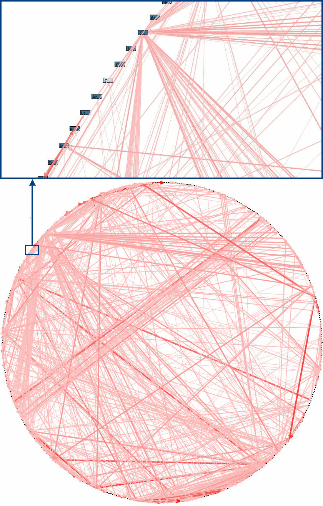
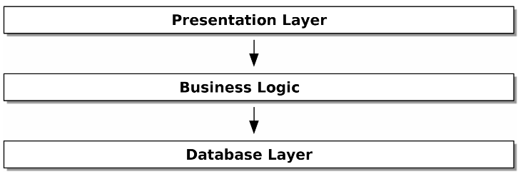

# Introduction to Architecture Patterns
## Why do designs go wrong?

Software designs tend toward chaos. When we start a project, we have a clear vision of how the software should be structured. However, as the project evolves, we find that our sensibly layered architecture has collapsed into a tangled mess of dependencies.

Chaotic software systems are characterized by a sameness of a function: API handlers that have domain knowledge and send email and perform logging; "business logic" classes that have database access and perform calculations; and so on. 

This is so common that software engineers have their own term for chaos: the **Big Ball of Mud** anti-pattern as seen in Figure 1.

<p align="center">
   <br>
  <em>Figure 1: The Big Ball of Mud</em>
</p>


Fortunately, the techniques for avoiding the Big Ball of Mud are well-known.

## Encapsulation and Abstractions
The key to avoiding the Big Ball of Mud is to use **encapsulation** and **abstractions**.

The term **encapsulation** covers two closely related ideas: simplifying behavior and hiding implementation details. We encapsulate behavior by identifying a task and giving that task a well-defined object or function.

Below are two examples of different levels of encapsulation and abstraction. The first example is a script with low encapsulation and abstraction. The second example does the same thing but with higher encapsulation and abstraction.

````python
# A script with low encapsulation and abstraction
import json
from urllib.request import urlopen
from urllib.parse import urlencode

params = dict(q='Sausages', format='json')
handle = urlopen('https://en.wikipedia.org/w/api.php?' + urlencode(params))
raw_text = handle.read()
data = json.loads(raw_text)

results = data['RelatedTopics']
for r in results:
    if 'Text' in r:
        print(r['Text'])
````

````python
# A script with higher encapsulation and abstraction
import duckduckgo
for r in duckduckgo.search('Sausages').results:
    print(r.text)
````

**Note**:
In the literature of the object-oriented world, one of the classic characterizations of this approach is called **responsability-driven design**; it uses the words roles and responsabilities rather than tasks. The idea is that we should design our software around the responsibilities of the objects. The main point is to think about code in terms of behavior, rather than in terms of algorithms.

## Layering
Encapsulation and abstraction help us by hiding details and simplifying behavior, but we also need to pay attention to the interactions between our objects and functions. When one function, module, or object uses another, we say that the one depends on the other.

In a layered architecture, we divide our code into roles, and we introduce rules about which categories of code can call each other. One of the most common examples is the three-layered architecture shown in Figure 2.

<p align="center">
   <br>
  <em>Figure 2: A three-layered architecture</em>
</p>

We have user-interface components, which could be a web page, an API, or a command line; these user-interface components communicate with a business logic layer that contains our business rules and our workflows; and finally, we have a database layer.

## The Dependency Inversion Principle
The dependency inversion principle is the D in SOLID, more information can be found [here](solid.md).

The DIP's formal definition is as follows:
1. High-level modules should not depend on low-level modules. Both should depend on abstractions.
2. Abstractions should not depend on details. Details should depend on abstractions.

The high-level modules of a software system are the functions, classes, and packages that deal with our real-world concepts. Perhaps you work for a bank, and your high-level modules are things like `Account`, `Customer`, and `Transaction`. The low-level modules are the ones that deal with technical details, such as database access, network communication, and so on.

Depends on doesn't mean **imports or calls**, but rather a more general idea that one module knows about or needs another module. 

So the first part of the DIP says that our business code shouldn't depend on technical details; both should depend on abstractions. We need to be able to change our database access code without changing our business logic, and we need to be able to change our business logic without changing our database access code. Adding an abstraction layer between the two allows us to achieve this.

The second part is tricky to understand, but it means that our abstractions shouldn't depend on details. If we have an interface for our database access, that interface shouldn't depend on the specific database we're using. Instead, the details of how we access the database should depend on the abstraction of the database access interface. This topic is covered in more detail until chapter 4.
